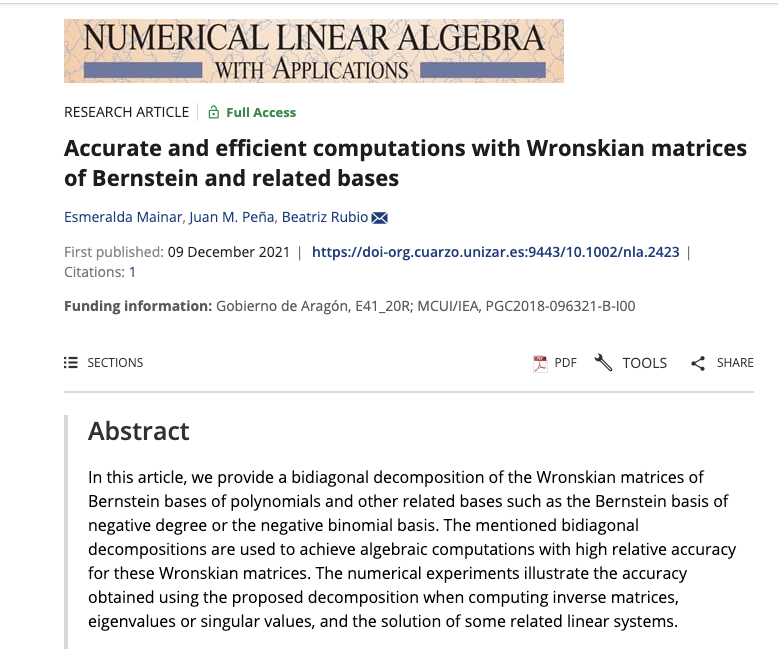

# Accurate and efficient computations with Wronskian matrices of Bernstein and related bases 

Mainar E, Peña JM, Rubio B. Accurate and efficient computations with Wronskian matrices of Bernstein and related bases. Numer LinearAlgebra Appl. 2022;29(3):e2423.
https://doi.org/10.1002/nla.2423

In [Wronskian_Bernstein_bases](https://github.com/BeatrizRubio/Wronskian_Bersntein_bases/tree/main/Wronskian_Bernstein_bases) the bidiagonal decomposition of Bernstein bases of polynomials and other related bases such as the Bernstein basis of negative degree or the negative binomial basis are provided. Experiment results obtained with the functions available in http://math.mit.edu/~plamen/software/TNTool.html are provided. We also include the relative errors obtained in Mathematica. 

The implementation uses Matlab 2021b and Wolfram Mathematica. 
